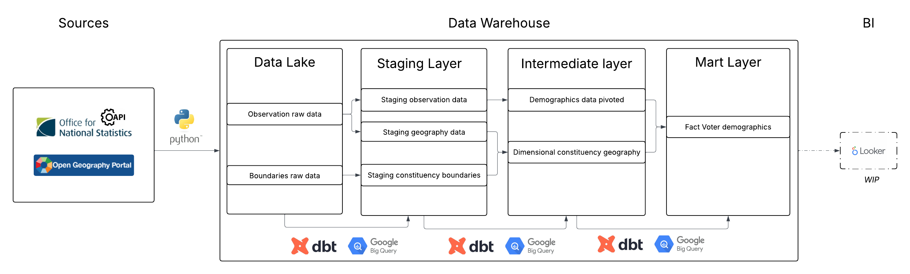

# UK Census 2021 Voter Analytics

This project builds a multi-layered dbt pipeline on Census 2021 data into campaign-ready datasets for Westminster Parliamentary constituencies.

## 🏗️ Architecture



Data pipeline from ONS API extraction through dbt dimensional modeling.

## 📊 Project Overview

- **Geographic Scope:** 650 Westminster Parliamentary constituencies
- **Data Dimensions:** 7 demographic factors (age, ethnicity, education, religion, economic status, national identity, sex)
- **Pipeline:** Python → BigQuery → dbt (staging/intermediate/marts)
- **Data Quality:** 27 automated tests
- **Visualization:** Looker Studio *(in development)*

### Technical Stack

| Component | Technology |
|-----------|------------|
| Data Extraction | Python, Jupyter Notebooks |
| Data Warehouse | Google BigQuery |
| Transformation | dbt Cloud |
| Version Control | GitHub |
| Visualization | Looker Studio *(in development)* |

### Pipeline Layers
```
models/
├── staging/ # 3 models - cleaned source data
│ ├── stg_census__geography
│ ├── stg_census__observations
│ └── stg_census__boundaries
├── intermediate/ # 1 model - pivoted demographics
│ └── int_demographics__pivoted (36 demographic columns)
└── marts/ # 2 models - star schema
├── dim_geography (with WKT boundaries)
└── fct_voter_demographics (campaign metrics)
```

## ✅ Data Quality

27 automated tests covering:
- Primary/foreign key constraints (unique, not_null)
- Referential integrity (relationships between tables)
- Null validation
- Range checks (percentages 0-100, diversity index 0-1)
- Business logic validation (population > 0)

## 🎯 Key Metrics

The fact table includes campaign-relevant metrics:
- `pct_youth_vote` - 18-34 age cohort percentage
- `pct_ethnic_minority` - Diversity measure
- `pct_degree_educated` - Higher education attainment
- `diversity_index` - Ethnic composition indicator
- All raw population counts and calculated percentages

## 📖 Documentation

[View Interactive dbt Documentation](https://nm855.us1.dbt.com/accounts/70471823518405/jobs/70471823543815/docs/#!/source_list/census_raw)

### Data Lineage


## 🚀 Running the Project

```bash
# Install dependencies
dbt deps

# Run all models and tests
dbt build

# Generate documentation
dbt docs generate
dbt docs serve
```

## 📝 Author
Alessandro Gallo
