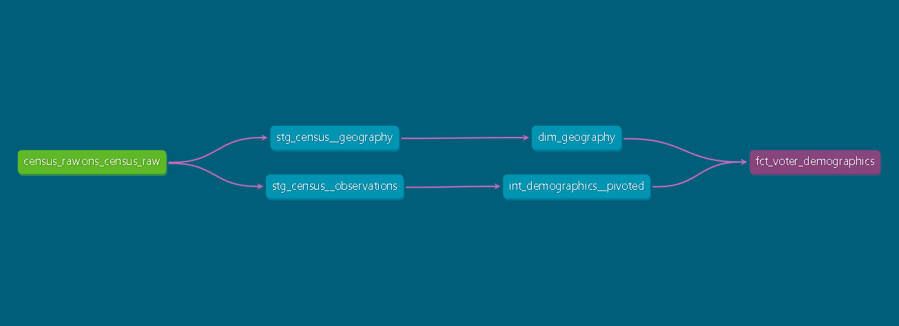

# UK Census 2021 Analytics

dbt project transforming UK Census 2021 data into analysis-ready datasets for demographic insights.

## 📊 Project Overview

This project builds a multi-layered dbt pipeline on Census 2021 data, using dimensional modeling (staging → intermediate → marts) with automated testing and documentation.

**The pipeline includes:**
- 2 staging models (cleaned source data)
- 1 intermediate model (demographic calculations)
- 2 marts (final analytics tables)
- 23 automated data quality tests
- Interactive documentation with lineage tracking
- CI/CD deployment with dbt Cloud

## 🛠️ Technology Stack

- **Data Warehouse**: Google BigQuery
- **Transformation**: dbt (data build tool)
- **Version Control**: Git/GitHub
- **Orchestration**: dbt Cloud

## 📁 Project Structure

```
models/
├── staging/ # Raw Census data cleaned and standardized
│ ├── stg_census__geography
│ └── stg_census__observations
├── intermediate/ # Demographic calculations and pivots
│ └── int_demographics__pivoted
└── marts/ # Final analytics-ready models
├── dim_geography
└── fct_voter_demographics
```

### Data Lineage



The DAG shows the full data flow from raw source through staging and intermediate layers to final marts.

## ✅ Data Quality

23 automated tests covering:
- Uniqueness and referential integrity
- Null value constraints
- Range validation (percentages, diversity indices)

## 📖 Documentation

Interactive documentation with model descriptions and lineage graphs:

[View Documentation](https://nm855.us1.dbt.com/accounts/70471823518405/jobs/70471823543815/docs/#!/source_list/census_raw)

## 🚀 How to Run

```
dbt build # Run all models and tests
dbt docs generate # Generate documentation
dbt test # Run data quality tests only
```

## 📝 Author

Alessandro Gallo
